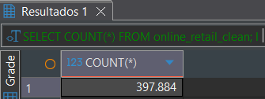
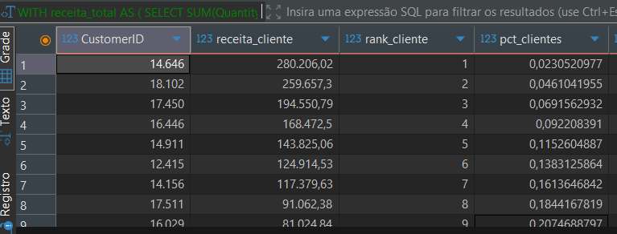
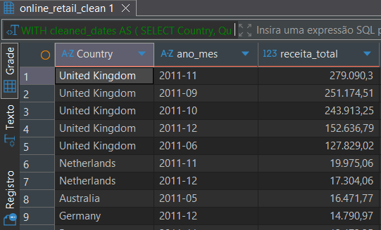
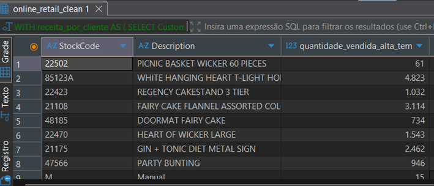

# Análise Exploratória de Vendas - Online Retail

Este projeto imerge nos dados de um e-commerce para gerar insights valiosos no campo de Business Intelligence. Nosso objetivo é auxiliar empresas (aqui, representadas por um conjunto de dados fictícios) a aprimorar suas estratégias comerciais, respondendo fundamentalmente à questão: "Como podemos aumentar as vendas e a rentabilidade do nosso e-commerce?"

### Como os Dados Foram Obtidos e o Projeto Foi Organizado

Para esta análise, utilizamos o dataset "Online Retail", acessado publicamente no Kaggle (link: https://www.kaggle.com/datasets/vijayuv/onlineretail). O arquivo `OnlineRetail.csv` foi baixado e armazenado localmente para o desenvolvimento do projeto.

Com o intuito de manter a clareza e facilitar o acesso, uma estrutura de pastas foi estabelecida:
* A pasta `data/` armazena os dados brutos (`data/raw`, contendo o `OnlineRetail.csv`) e os dados processados (`data/processed`).
* Na `sql/`, encontram-se todas as consultas e análises desenvolvidas em SQL.
* O `looker/` é dedicado à criação de painéis e visualizações no Power BI.
* Uma nota: a pasta `python/` foi inicialmente planejada, mas a priorização da análise em SQL levou à sua remoção para otimizar o foco do projeto.

Todo o trabalho está documentado no GitHub (`https://github.com/ALENKABITENCOURT/analise-vendas-ecommerce.git`), o que permite acompanhar cada alteração e assegurar a visibilidade das pastas (inclusive com o uso de arquivos `.gitkeep` em diretórios que, de outra forma, ficariam vazios).

**Observação Essencial**: Antes de qualquer análise, é fundamental uma imersão nos dados para compreender sua estrutura e conteúdo. O dataset em questão detalha transações de uma loja online do Reino Unido, registrando vendas entre 1º de dezembro de 2010 e 9 de dezembro de 2011. Ele apresenta informações como número da fatura (`InvoiceNo`), código e descrição do produto (`StockCode`, `Description`), quantidade (`Quantity`), preço unitário (`UnitPrice`), data e hora da transação (`InvoiceDate`), identificação do cliente (`CustomerID`) e país de origem (`Country`). Este recurso é inestimável para compreender padrões de compra e extrair insights estratégicos para o negócio.

### Hipótese 1: Clientes VIP (Os Clientes Mais Valiosos)

Nossa primeira hipótese de trabalho sustenta que uma pequena porcentagem dos clientes, a quem denominamos 'Clientes VIP', é responsável pela maior parte da receita total do e-commerce. A identificação e aprofundamento na compreensão desses clientes é crucial para o desenvolvimento de programas de fidelidade eficazes e estratégias de retenção.

#### Limpeza de Dados Fundamental para a Análise de Clientes

Antes de identificar os Clientes VIP, foi necessário realizar uma etapa rigorosa de limpeza de dados. O dataset original continha transações sem um `CustomerID` atribuído, além de registros com `Quantity` ou `UnitPrice` menores ou iguais a zero (indicando devoluções, cancelamentos ou cortesias). Para assegurar a precisão da análise, a remoção desses dados foi essencial.

Inicialmente, criamos uma tabela `online_retail_clean` filtrando transações com `Quantity > 0` e `UnitPrice > 0`. No entanto, percebemos que um volume significativo de aproximadamente 132 mil transações ainda não possuía `CustomerID` (representados por strings vazias ou nulas). Essa ausência de identificação impede a atribuição de um comportamento de compra específico a esses consumidores, resultando em uma perda considerável de insights para marketing e retenção. Essa observação levanta um ponto de atenção para o time de negócios, que deveria investigar a causa dessa falha na identificação do cliente no momento da compra.

Para resolver essa questão e garantir uma análise de clientes completa, a tabela `online_retail_clean` foi recriada com um filtro adicional, considerando apenas transações com um `CustomerID` válido.

```sql

-- Excluímos a tabela anterior para recriá-la com um filtro mais rigoroso para CustomerID

DROP TABLE online_retail_clean;

-- Recriação da tabela limpa, excluindo transações com CustomerID nulo ou vazio

CREATE TABLE online_retail_clean AS
SELECT *
FROM OnlineRetail
WHERE
    Quantity > 0
AND
    UnitPrice > 0
AND
    TRIM(CustomerID) != '';

-- Contagem de linhas após a limpeza para CustomerID: 397.884 linhas

SELECT COUNT(*) FROM online_retail_clean;

``` 



Identificação dos Clientes VIP

Com os dados devidamente limpos, o próximo passo consistiu em identificar os clientes que mais contribuem para a receita. Para isso, ranqueamos os clientes com base no seu valor total de compra.

```sql

WITH receita_total AS (
    SELECT SUM(Quantity * UnitPrice) AS total_receita
    FROM online_retail_clean
    WHERE CustomerID IS NOT NULL
),

receita_por_cliente AS (
    SELECT
        CustomerID,
        SUM(Quantity * UnitPrice) AS receita_cliente
    FROM online_retail_clean
    WHERE CustomerID IS NOT NULL
    GROUP BY CustomerID
),

clientes_ordenados AS (
    SELECT
        CustomerID,
        receita_cliente,
        ROW_NUMBER() OVER (ORDER BY receita_cliente DESC) AS rank_cliente
    FROM receita_por_cliente
)

SELECT
    CustomerID,
    receita_cliente,
    rank_cliente,
    (rank_cliente * 100.0 / (SELECT COUNT(*) FROM clientes_ordenados)) AS pct_clientes,
    (SUM(receita_cliente) OVER (ORDER BY rank_cliente) * 100.0 / (SELECT total_receita FROM receita_total)) AS pct_receita_acumulada
FROM clientes_ordenados
ORDER BY rank_cliente
LIMIT 10;

```



Os resultados desta análise confirmam de forma contundente nossa hipótese inicial e demonstram uma clara aderência ao Princípio de Pareto (ou Regra 80/20). Observamos que:

•	Uma porcentagem muito pequena de clientes é, de fato, responsável por uma fatia desproporcionalmente grande da receita.
•	Identificamos, por exemplo, que apenas 0,48% dos clientes (referente ao rank 21 da nossa análise completa, não limitada a 10) já contribuem com 24,35% da receita total.

•	Expandindo essa análise, verificamos que apenas 4,6% dos clientes geram quase metade da receita do e-commerce. Ao considerarmos os 200 clientes mais valiosos (rank 200), a receita acumulada atinge impressionantes 49,23% do total.

O cliente de ID 14646 se destaca como o principal VIP, gerando sozinho mais de R$ 280 mil em receita. Embora a maioria dos Clientes VIP seja do Reino Unido, a presença de clientes da Holanda (como o próprio 14646), Irlanda e Austrália indica que o alto valor não se limita apenas ao mercado doméstico. O que esses clientes têm em comum não é a localização geográfica, mas sim uma notável disposição para gastar e o valor substancial que agregam ao negócio.

Perfis de Compra dos Clientes VIP

Para aprofundar a compreensão sobre o comportamento dos nossos Clientes VIP, investigamos se eles tendem a realizar compras de alta frequência (muitas transações de menor valor) ou de alto valor por compra (poucas transações de grande valor). A consulta a seguir analisa o número de compras e o ticket médio dos cinco clientes com maior receita.

```sql

SELECT
    CustomerID AS ID_Cliente,
    COUNT(DISTINCT InvoiceNo) AS NumeroDeCompras,
    SUM(ROUND(Quantity * UnitPrice, 2)) AS ValorTotalDeCompra,
    AVG(ROUND(Quantity * UnitPrice, 2)) AS TicketMedio
FROM online_retail_clean
WHERE CustomerID IN ('14646', '18102', '17450', '16446', '14911') -- Apenas os top 5
GROUP BY ID_Cliente
ORDER BY ValorTotalDeCompra DESC;

```


Essa análise revela dois perfis distintos entre os Clientes VIP:

•	Clientes de Alto Valor e Frequência Moderada: O cliente de ID 14646, por exemplo, registrou a segunda maior quantidade de compras (73), mas seu valor total de compra é o maior, o que sugere que ele adquire predominantemente itens de valor mais elevado.

•	Clientes de Alta Frequência e Valor por Compra Menor: O cliente de ID 14911 apresenta a maior quantidade de compras (201), porém com uma receita total menor em comparação aos outros VIPs, indicando que suas aquisições são de itens com valor unitário mais baixo.
Ambos os perfis são extremamente valiosos para o e-commerce, demonstrando alta fidelidade e merecendo estratégias de valorização e retenção.

Recomendações de Negócio para Clientes VIP

Com base nesses insights, diversas ações estratégicas podem ser implementadas para maximizar o relacionamento e a receita gerada pelos Clientes VIP:

•	Programas de Fidelidade Exclusivos: Desenvolver programas de recompensa específicos que ofereçam benefícios, reconhecimento diferenciado e acesso a produtos ou eventos especiais.

•	Comunicação Personalizada: Criar campanhas de e-mail marketing e ofertas exclusivas que considerem os perfis de compra (itens de alto valor vs. alta frequência) e os produtos que esses clientes já demonstraram preferência.

•	Atendimento ao Cliente Prioritário: Oferecer canais de suporte dedicados ou tempos de resposta mais rápidos para esses clientes, reforçando a percepção de valor e exclusividade.

•	Marketing Segmentado: Direcionar esforços de marketing para produtos e promoções que estejam alinhados com o histórico de compra e o perfil de cada grupo VIP.

•	Investigação da Origem dos Clientes Não Identificados: O time de negócios deve investigar proativamente o motivo pelo qual 132 mil transações não possuem CustomerID atribuído. Implementar soluções para identificar esses compradores no momento da compra é crucial para expandir a base de clientes passíveis de análise, relacionamento e, futuramente, mensurar a satisfação (NPS - Net Promoter Score).

Hipótese 2: Sazonalidade das Vendas

Nossa segunda hipótese de negócio explora a ideia de que as vendas do e-commerce demonstram variações significativas ao longo do ano, com picos notáveis em meses próximos a datas comemorativas ou períodos específicos. Compreender essa sazonalidade é fundamental para otimizar o planejamento de estoque e intensificar as campanhas de marketing nos momentos mais oportunos.

Tratamento e Análise da Sazonalidade Geral

Para investigar as tendências sazonais, o primeiro desafio foi padronizar o formato da coluna InvoiceDate, que apresentava diversas variações. Após o tratamento, pudemos agregar a receita por mês/ano e identificar os períodos de maior e menor movimento.
A consulta a seguir foi utilizada para extrair o mês e o ano da InvoiceDate e calcular a receita total mensal:

```sql

WITH cleaned_dates AS (
    SELECT
        Quantity,
        UnitPrice,
        CASE
            WHEN InvoiceDate GLOB '[0-9][0-9]/[0-9][0-9]/[0-9][0-9][0-9][0-9]*' THEN
                strftime('%Y-%m',
                    SUBSTR(InvoiceDate, 7, 4) || '-' ||
                    SUBSTR(InvoiceDate, 4, 2) || '-' ||
                    SUBSTR(InvoiceDate, 1, 2))
            WHEN InvoiceDate GLOB '[0-9]/[0-9][0-9]/[0-9][0-9][0-9][0-9]*' THEN
                strftime('%Y-%m',
                    SUBSTR(InvoiceDate, 6, 4) || '-' ||
                    SUBSTR(InvoiceDate, 3, 2) || '-' ||
                    '0' || SUBSTR(InvoiceDate, 1, 1))
            WHEN InvoiceDate GLOB '[0-9][0-9]/[0-9]/[0-9][0-9][0-9][0-9]*' THEN
                strftime('%Y-%m',
                    SUBSTR(InvoiceDate, 6, 4) || '-' ||
                    '0' || SUBSTR(InvoiceDate, 4, 1) || '-' ||
                    SUBSTR(InvoiceDate, 1, 2))
            ELSE NULL
        END AS ano_mes
    FROM online_retail_clean
    WHERE InvoiceDate IS NOT NULL
      AND InvoiceDate != ''
)

SELECT
    ano_mes,
    ROUND(SUM(Quantity * UnitPrice), 2) AS receita_total
FROM
    cleaned_dates
WHERE
    ano_mes IS NOT NULL
GROUP BY
    ano_mes
ORDER BY
    receita_total DESC;

```


Resultados e Análise da Sazonalidade:

Os resultados da análise de receita mensal revelam uma clara tendência de sazonalidade:

•	Observa-se um pico de vendas muito forte nos últimos meses de 2011.

•	O mês mais lucrativo foi Novembro de 2011, registrando uma receita total de R$ 345.332,09.

•	A tendência clara é que a receita se mantém em um nível mais baixo no início do ano e acelera significativamente a partir de Setembro, atingindo seu ponto máximo em Novembro e Dezembro.

Sazonalidade por País (Exemplo: Reino Unido)

Uma análise mais aprofundada por país, como para o Reino Unido (que representa a maior parte das vendas), também reforça essa tendência, identificando os meses de maior e menor lucratividade.

```sql

WITH cleaned_dates AS (
    SELECT
        Country,
        Quantity,
        UnitPrice,
        CASE
            WHEN InvoiceDate GLOB '[0-9][0-9]/[0-9][0-9]/[0-9][0-9][0-9][0-9]*' THEN
                strftime('%Y-%m',
                    SUBSTR(InvoiceDate, 7, 4) || '-' ||
                    SUBSTR(InvoiceDate, 4, 2) || '-' ||
                    SUBSTR(InvoiceDate, 1, 2))
            WHEN InvoiceDate GLOB '[0-9]/[0-9][0-9]/[0-9][0-9][0-9][0-9]*' THEN
                strftime('%Y-%m',
                    SUBSTR(InvoiceDate, 6, 4) || '-' ||
                    SUBSTR(InvoiceDate, 3, 2) || '-' ||
                    '0' || SUBSTR(InvoiceDate, 1, 1))
            WHEN InvoiceDate GLOB '[0-9][0-9]/[0-9]/[0-9][0-9][0-9][0-9]*' THEN
                strftime('%Y-%m',
                    SUBSTR(InvoiceDate, 6, 4) || '-' ||
                    '0' || SUBSTR(InvoiceDate, 4, 1) || '-' ||
                    SUBSTR(InvoiceDate, 1, 2))
            ELSE NULL
        END AS ano_mes
    FROM online_retail_clean
    WHERE InvoiceDate IS NOT NULL
      AND InvoiceDate != ''
),

country_monthly_revenue AS (
    SELECT
        Country,
        ano_mes,
        ROUND(SUM(Quantity * UnitPrice), 2) AS receita_total,
        ROW_NUMBER() OVER (PARTITION BY Country ORDER BY SUM(Quantity * UnitPrice) DESC) AS country_rank
    FROM cleaned_dates
    WHERE ano_mes IS NOT NULL
    GROUP BY Country, ano_mes
)

SELECT
    Country,
    ano_mes,
    receita_total
FROM country_monthly_revenue
WHERE country_rank <= 5
ORDER BY
    receita_total DESC,
    Country;

```




Para o Reino Unido, por exemplo, os meses mais rentáveis são Novembro, Setembro, Outubro, Dezembro e Junho. Em contraste, os meses com menor lucratividade incluem Agosto, Fevereiro, Janeiro, Outubro (do ano anterior) e Abril.

Recomendações de Negócio para a Sazonalidade

Com base nessas tendências sazonais, as seguintes ações podem ser propostas:

•	Intensificar Campanhas de Marketing: Fortalecer e lançar novas campanhas para os meses de alta temporada (Setembro a Dezembro), capitalizando em períodos de grande consumo e preparativos para o Natal e Ano Novo.

•	Gestão de Estoque Otimizada: Ajustar os níveis de estoque para garantir que os produtos de alta demanda estejam disponíveis em abundância nos meses de pico, minimizando rupturas de estoque e perdas de vendas.

•	Estratégias para Baixa Temporada: Desenvolver campanhas específicas e promoções atrativas para os meses de menor receita (como Janeiro, Fevereiro e Abril), aproveitando datas comemorativas menores ou eventos locais para estimular as vendas.


Hipótese 3: Oportunidades de Venda Cruzada e Produtos Complementares

Nossa terceira hipótese busca identificar quais produtos os clientes mais valiosos (VIPs) tendem a comprar juntos, especialmente durante os meses de alta temporada. O objetivo é descobrir oportunidades de venda cruzada (cross-selling) e de criação de kits promocionais que possam aumentar o ticket médio e a rentabilidade do e-commerce.

Produtos de Alto Desempenho entre Clientes VIP na Alta Temporada

Para iniciar esta análise, investigamos quais produtos geram mais receita entre os clientes VIP nos meses de alta temporada (Outubro, Novembro e Dezembro). Esta etapa nos ajuda a entender quais itens são os "carros-chefe" desse segmento valioso.

```sql

WITH receita_por_cliente AS (
    SELECT
        CustomerID,
        SUM(Quantity * UnitPrice) AS receita_cliente
    FROM online_retail_clean
    WHERE CustomerID IS NOT NULL AND Quantity > 0 AND UnitPrice > 0
    GROUP BY CustomerID
),

clientes_ordenados AS (
    SELECT
        CustomerID,
        ROW_NUMBER() OVER (ORDER BY receita_cliente DESC) AS rank_cliente
    FROM receita_por_cliente
),

clientes_vip AS (
    SELECT
        CustomerID
    FROM clientes_ordenados
    WHERE rank_cliente <= 200
),

transacoes_com_mes AS (
    SELECT
        CustomerID,
        StockCode,
        Description,
        Quantity,
        UnitPrice,
        CASE
            WHEN InvoiceDate LIKE '__/__/____%' THEN SUBSTR(InvoiceDate, 4, 2)
            WHEN InvoiceDate LIKE '_/__/____%' THEN SUBSTR(InvoiceDate, 3, 2)
            WHEN InvoiceDate LIKE '__/_/____%' THEN '0' || SUBSTR(InvoiceDate, 4, 1)
            ELSE NULL
        END AS mes_numero
    FROM online_retail_clean
)

SELECT
    t1.StockCode,
    t1.Description,
    SUM(t1.Quantity) AS quantidade_vendida_alta_temporada,
    ROUND(SUM(t1.Quantity * t1.UnitPrice), 2) AS receita_alta_temporada
FROM
    transacoes_com_mes AS t1
JOIN
    clientes_vip AS t2 ON t1.CustomerID = t2.CustomerID
WHERE
    t1.mes_numero IN ('10', '11', '12')
GROUP BY
    t1.StockCode, t1.Description
ORDER BY
    receita_alta_temporada DESC;

```



Resultados:

A análise revelou que o item PICNIC BASKET WICKER 60 PIECES é o principal motor de receita entre os clientes VIP durante a alta temporada, destacando-se significativamente dos demais produtos com uma receita de R$ 39.619,50. Outros itens de alto desempenho incluem WHITE HANGING HEART T-LIGHT HOLDER, REGENCY CAKESTAND 3 TIER e FAIRY CAKE FLANNEL ASSORTED COLOUR, que são predominantemente itens de casa, cozinha e festa.

Esses achados são cruciais para priorizar o estoque desses itens, garantindo que eles nunca fiquem em falta, especialmente nos meses de maior demanda, maximizando as oportunidades de venda.

Identificação de Combinações de Produtos para Venda Cruzada

O próximo passo foi identificar quais produtos os clientes VIP compram juntos, especialmente durante a alta temporada. Esta etapa é fundamental para revelar oportunidades diretas de venda cruzada e de formação de conjuntos de produtos.

```sql

WITH receita_por_cliente AS (
    SELECT
        CustomerID,
        SUM(Quantity * UnitPrice) AS receita_cliente
    FROM online_retail_clean
    WHERE CustomerID IS NOT NULL AND Quantity > 0 AND UnitPrice > 0
    GROUP BY CustomerID
),

clientes_ordenados AS (
    SELECT
        CustomerID,
        ROW_NUMBER() OVER (ORDER BY receita_cliente DESC) AS rank_cliente
    FROM receita_por_cliente
),

clientes_vip AS (
    SELECT
        CustomerID
    FROM clientes_ordenados
    WHERE rank_cliente <= 200
),

transacoes_com_mes AS (
    SELECT
        InvoiceNo,
        CustomerID,
        StockCode,
        Description,
        Quantity,
        UnitPrice,
        CASE
            WHEN InvoiceDate LIKE '__/__/____%' THEN SUBSTR(InvoiceDate, 4, 2)
            WHEN InvoiceDate LIKE '_/__/____%' THEN SUBSTR(InvoiceDate, 3, 2)
            WHEN InvoiceDate LIKE '__/_/____%' THEN '0' || SUBSTR(InvoiceDate, 4, 1)
            ELSE NULL
        END AS mes_numero
    FROM online_retail_clean
),

produtos_ancora AS (
    SELECT StockCode, Description FROM online_retail_clean
    WHERE Description IN (
        'PICNIC BASKET WICKER 60 PIECES',
        'WHITE HANGING HEART T-LIGHT HOLDER',
        'REGENCY CAKESTAND 3 TIER'
    )
    GROUP BY StockCode, Description
)

SELECT
    t1.Description AS produto_ancora,
    t2.Description AS produto_frequentemente_comprado_junto,
    COUNT(DISTINCT t1.InvoiceNo) AS frequencia_de_compra_conjunta
FROM
    transacoes_com_mes AS t1
JOIN
    transacoes_com_mes AS t2 ON t1.InvoiceNo = t2.InvoiceNo AND t1.StockCode != t2.StockCode
JOIN
    clientes_vip AS t3 ON t1.CustomerID = t3.CustomerID
WHERE
    t1.mes_numero IN ('10', '11', '12')
    AND t2.mes_numero IN ('10', '11', '12')
    AND t1.StockCode IN (SELECT StockCode FROM produtos_ancora)
GROUP BY
    t1.Description,
    t2.Description
ORDER BY
    frequencia_de_compra_conjunta DESC;

```


Resultados e Insights:

Esta análise de associação de produtos revela padrões de compra valiosos:

•	Coleções Completas: O REGENCY CAKESTAND 3 TIER frequentemente aparece associado a itens como REGENCY TEA PLATE ROSES e REGENCY TEAPOT ROSES. Isso indica que os clientes VIP buscam completar coleções, sugerindo uma excelente oportunidade para oferecer pacotes promocionais contendo esses conjuntos.

•	Kits para Eventos: A combinação do REGENCY CAKESTAND 3 TIER com JUMBO BAG RED RETROSPOT e PARTY BUNTING sugere que esses clientes estão organizando eventos ou festas. A criação de "kits festa" pré-montados ou temáticos poderia ser muito atrativa para esse perfil.

•	Produtos Autossuficientes: Curiosamente, o PICNIC BASKET WICKER 60 PIECES não aparece com alta frequência em combinações de venda cruzada significativas (exceto com o "SMALL" correspondente). Isso reforça o insight de que ele é um item de alto valor que, por si só, é um grande motor de receita e, portanto, não necessita de complementos para ser vendido. Ele gera alto valor individualmente, e sua disponibilidade deve ser prioritária.

Recomendações de Negócio para Venda Cruzada

Com base nessas descobertas, as seguintes recomendações podem ser implementadas para impulsionar as vendas cruzadas e aumentar o valor do carrinho:

•	Implementar Recomendações de Produto Dinâmicas: Adicionar seções de "Comprado frequentemente junto" ou "Você também pode gostar" no carrinho de compras ou nas páginas dos produtos, com base nas combinações identificadas e na complementaridade funcional dos itens (ex: REGENCY CAKESTAND e seus complementos).

•	Desenvolver Kits e Pacotes Promocionais: Criar e promover ativamente kits de produtos que se complementam, como "Kit Festa Regency" ou "Coleção Rosas para Chá", oferecendo um valor agregado ao cliente e incentivando compras maiores.

•	Marketing Direcionado com Complementos: Utilizar os insights sobre as combinações de produtos em campanhas de e-mail marketing ou anúncios direcionados, oferecendo itens complementares aos clientes que já adquiriram um dos produtos da combinação, incentivando uma nova compra.

Conclusão e Recomendações de Negócio Finais

A análise exploratória do dataset 'Online Retail' revelou insights valiosos que podem guiar o e-commerce a estratégias mais eficientes, focadas em aumentar a receita e a rentabilidade. As principais descobertas podem ser sintetizadas em três áreas-chave: Clientes VIP, Sazonalidade das Vendas e Oportunidades de Venda Cruzada.

Resumo das Descobertas

•	Clientes VIP: A análise confirmou a validade da Regra de Pareto, mostrando que uma pequena porcentagem da base de clientes é responsável por uma parcela desproporcionalmente grande da receita. Clientes como o de ID 14646 demonstram um valor significativo, e sua identificação é crucial para qualquer estratégia de fidelização.

•	Sazonalidade das Vendas: O comportamento de compra dos clientes apresenta uma flutuação sazonal bem definida. As vendas se mantêm em um nível mais baixo no início do ano (de janeiro a setembro) e aceleram significativamente no último trimestre (outubro a dezembro), impulsionadas por períodos festivos e de alto consumo de itens de casa, cozinha e festa.

•	Oportunidades de Venda Cruzada: Foi possível identificar padrões de compra de produtos que se complementam. Em particular, a coleção REGENCY demonstra que clientes VIP buscam completar conjuntos (ex: REGENCY CAKESTAND 3 TIER comprado com REGENCY TEA PLATE ROSES e REGENCY TEAPOT ROSES). Por outro lado, itens como o PICNIC BASKET WICKER 60 PIECES se destacam como produtos de alto valor que, por si só, são motores de receita, sem a necessidade de venda cruzada.

Recomendações Estratégicas e Planos de Ação

Com base nas conclusões apresentadas, as seguintes recomendações estratégicas são propostas para otimizar as operações e impulsionar o crescimento do e-commerce:

1.	Fidelização e Relacionamento com Clientes VIP:

o	Implementar um Cadastro Robusto: É fundamental neutralizar a possibilidade de compras sem identificação do CustomerID. A obrigatoriedade de um cadastro, mesmo que simples e ágil, é essencial para o rastreamento do cliente, a construção de um relacionamento de longo prazo e a mensuração de satisfação (como o NPS).

o	Criar um Programa de Fidelidade Exclusivo: Desenvolver programas de recompensas, ofertas personalizadas e atendimento prioritário para os Clientes VIP, com o objetivo de aumentar sua proximidade com a marca e a receita recorrente.

o	Marketing Segmentado: Utilizar os perfis de compra (alta frequência vs. alto ticket médio) para criar campanhas publicitárias e comunicações direcionadas, aumentando o engajamento e a retenção.

2.	Planejamento Sazonal Otimizado:

o	Gestão de Estoque Proativa: Priorizar a disponibilidade dos produtos de alta demanda (como os itens de festa e cozinha) nos meses de pico (setembro a dezembro), garantindo que o estoque não se esgote e evitando perdas de vendas.

o	Estratégias para a Baixa Temporada: Criar campanhas de marketing e promoções atrativas para os meses de menor movimento (janeiro a agosto) para estimular as vendas e suavizar a flutuação de receita ao longo do ano.

3.	Aproveitamento da Venda Cruzada:

o	Implementar Recomendações de Produto Dinâmicas: Adicionar ao carrinho de compras ou às páginas dos produtos sugestões como "Comprado frequentemente junto" ou "Você também pode gostar", baseadas nas combinações identificadas (ex: REGENCY CAKESTAND e seus complementos).

o	Desenvolver Kits e Pacotes Promocionais: Criar e promover ativamente kits de produtos que se complementam, como "Kit Festa Regency" ou "Coleção Rosas para Chá", oferecendo um valor agregado ao cliente e incentivando compras maiores.

o	Priorizar Produtos-Destino: Focar o marketing e as vendas do PICNIC BASKET como um item de alto valor por si só, garantindo que ele esteja sempre em destaque e com estoque adequado, dada sua capacidade de gerar receita individualmente.

A aplicação desses insights, solidamente fundamentados na análise de dados, permitirá ao e-commerce operar de forma mais estratégica, transformando dados brutos em ações de negócio concretas para aumentar sua rentabilidade e solidificar a sua base de clientes.
